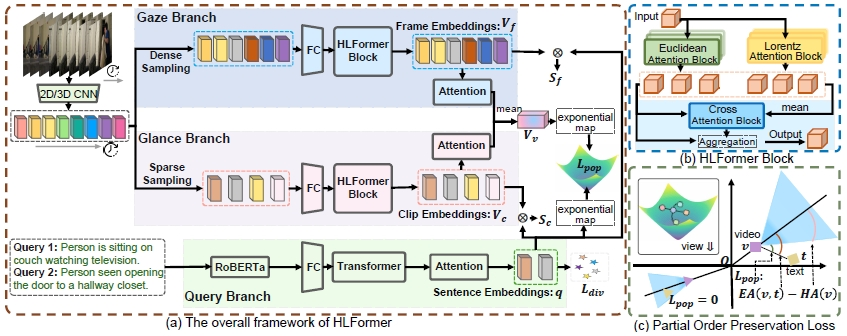

# HLFormer: Enhancing Partially Relevant Video Retrieval with Hyperbolic Learning
## 1. Introduction
This repository contains the **PyTorch** implementation of our work at **ICCV 2025**:

> [**Enhancing Partially Relevant Video Retrieval with Hyperbolic Learning**](http://arxiv.org/abs/2504.03587).  Jun Li, Jinpeng Wang, Chaolei Tan, Niu Lian, Long Chen, Min Zhang, Yaowei Wang, Shu-Tao Xia, Bin Chen.



We propose **HLFormer**, the *first* hyperbolic modeling framework for PRVR, which leverages hyperbolic space learning to compensate for the suboptimal hierarchical modeling capabilities of Euclidean space. HLFormer's designs are faithfully tailored for two core demands in PRVR, namely (**i**) temporal modeling to extract key moment features, and  (**ii**) learning robust cross-modal representations. 
For (i), we inject the **intra-video hierarchy prior** into the temporal modeling by introducing multi-scale Lorentz attention. 
It collaborates with the Euclidean attention and enhances activation of discriminative moment features relevant to queries. 
For (ii), we introduce $L_{pop}$ to impose a fine-grained 'text < video' semantic entailment constraint in hyperbolic space. This helps to model the **inter-video hierarchy prior** among videos and texts. 

Besides, we invite readers to refer to our previous work [GMMFormer](https://github.com/huangmozhi9527/GMMFormer) and [GMMFormerV2](https://github.com/huangmozhi9527/GMMFormer_v2).

In the following, we will guide you how to use this repository step by step. 🤗🐶

## 2. Preparation

```bash
git clone https://github.com/lijun2005/ICCV25-HLFormer.git
cd ICCV25-HLFormer/
```


### 2.1 Requirements

- python==3.11.8
- numpy==1.26.4
- pytorch==2.0.1
- torchvision==0.15.2
- scipy==1.5.4
- h5py==3.1.0
- addict==2.4.0
- pip install -r requirements.txt

### 2.2 Download the  feature datasets and organize them properly
All features of TVR, ActivityNet Captions and Charades-STA are kindly provided by the authors of [MS-SL].

**Please note that we did not use any features derived from ViT.**

The data can be downloaded from [Baidu pan](https://pan.baidu.com/s/1UNu67hXCbA6ZRnFVPVyJOA?pwd=8bh4) or [Google drive](https://drive.google.com/drive/folders/11dRUeXmsWU25VMVmeuHc9nffzmZhPJEj?usp=sharing). 

The dataset directory is organized as follows:

```bash
PRVR_data/
└── PRVR/
    ├── activitynet/
    │   ├── FeatureData/
    │   ├── TextData/
    │   ├── val_1.json
    │   └── val_2.json
    ├── charades/
    │   ├── FeatureData/
    │   └── TextData/
    └── tvr/
        ├── FeatureData/
        └── TextData/
```
Finally, set root and data_root in config files (*e.g.*, ./src/Configs/tvr.py).

## Run

To train GMMFormer_v2 on TVR:
```
cd src
python main.py -d tvr --gpu 0
```

To train GMMFormer_v2 on ActivityNet Captions:
```
cd src
python main.py -d act --gpu 0
```

To train GMMFormer_v2 on Charades-STA:
```
cd src
python main.py -d cha --gpu 0
```


## Trained Models

We provide trained GMMFormer_v2 checkpoints. You can download them from Baiduyun disk.

| *Dataset* | *ckpt* |
| ---- | ---- |
| TVR | [Baidu disk](https://pan.baidu.com/s/1GbHBvnr5Y7Tz43HU4K2p2w?pwd=9527) |
| ActivityNet Captions | [Baidu disk](https://pan.baidu.com/s/1nmgfyjg4SgeC9NM2kg02wg?pwd=9527) |
| Charades-STA | [Baidu disk](https://pan.baidu.com/s/1-_SBrQ1Tla-Rut-fdtnqCw?pwd=9527) |

## Results

### Quantitative Results

For this repository, the expected performance is:

| *Dataset* | *R@1* | *R@5* | *R@10* | *R@100* | *SumR* |
| ---- | ---- | ---- | ---- | ---- | ---- |
| TVR | 16.2 | 37.6 | 48.8 | 86.4 | 189.1 |
| ActivityNet Captions | 8.9 | 27.1 | 40.2 | 78.7 | 154.9 |
| Charades-STA | 2.6 | 8.5 | 13.7 | 54.0 | 78.7 |


[MS-SL]:https://github.com/HuiGuanLab/ms-sl


